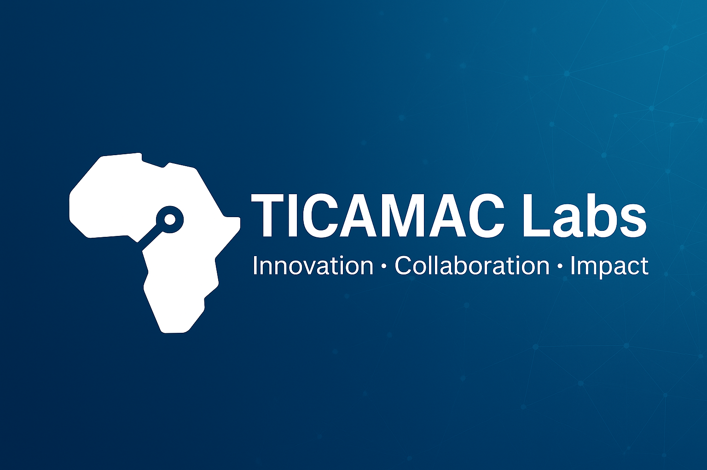

# 🌍 Laboratoires TICAMAC | TICAMAC Labs

Bienvenue dans l’organisation **TICAMAC-Labs**.  
Nous sommes le **hub d’innovation et de recherche appliquée** de TICAMAC, dédié à la conception, au prototypage et au déploiement de solutions technologiques à fort impact.  

---

## 🚀 Notre mission
- Fédérer les talents et les chercheurs autour de projets concrets.  
- Transformer les idées en prototypes fonctionnels et industrialisables.  
- Créer un écosystème technologique compétitif et durable.  

---

## 🛠 Domaines de R&D
- **Intelligence Artificielle & Data Science** – analyse prédictive, NLP, vision par ordinateur.  
- **Énergie & Technologies Vertes** – systèmes solaires, micro-réseaux intelligents, stockage.  
- **Systèmes Embarqués & IoT** – capteurs, dispositifs biomédicaux, villes intelligentes.  
- **Réseaux & Cybersécurité** – architectures avancées, SOC, sécurité Zero-Trust.  
- **Ingénierie Logicielle & Cloud** – plateformes SaaS, infrastructures scalables, DevOps.  

---

## 📚 TICAMAC Academy
Nous formons la prochaine génération de talents technologiques via  
[**TICAMAC Academy**](https://academy.ticamac.com), alliant **e-learning**, **labs pratiques** et **certifications**.  

---

## 🌐 Liens utiles
- Site : [ticamac.com](https://ticamac.com)  
- Academy : [academy.ticamac.com](https://academy.ticamac.com)  
- LinkedIn : [TICAMAC](https://www.linkedin.com/company/ticamac/)  
- Contact : [contact@ticamac.com](mailto:contact@ticamac.com)  

---

# 🌍 TICAMAC Labs (English)

Welcome to **TICAMAC-Labs**, the **applied research & innovation hub** of TICAMAC.  
We design, prototype, and deploy high-impact technologies.

## 🛠 Fields of R&D
- **AI & Data Science** – predictive analytics, NLP, computer vision.  
- **Energy & Green Tech** – solar systems, smart micro-grids, storage.  
- **Embedded Systems & IoT** – sensors, biomedical devices, smart cities.  
- **Networks & Cybersecurity** – advanced architectures, SOC, Zero-Trust.  
- **Software Engineering & Cloud** – SaaS platforms, scalable infra, DevOps.  

## 📚 TICAMAC Academy
We train tomorrow’s tech talents via  
[**TICAMAC Academy**](https://academy.ticamac.com): **online learning**, **hands-on labs**, **certifications**.

## 🌐 Useful links
- Official site: [ticamac.com](https://ticamac.com)  
- Academy: [academy.ticamac.com](https://academy.ticamac.com)  
- LinkedIn: [TICAMAC](https://www.linkedin.com/company/ticamac/)  
- Contact: [contact@ticamac.com](mailto:contact@ticamac.com)
